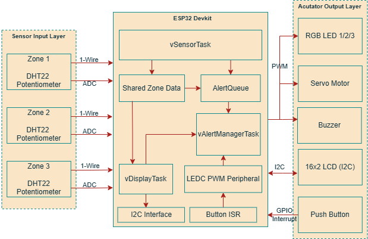
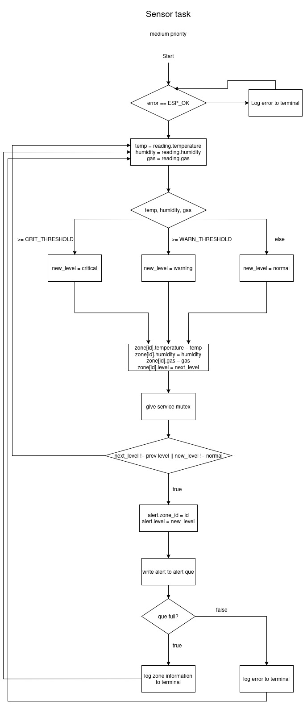
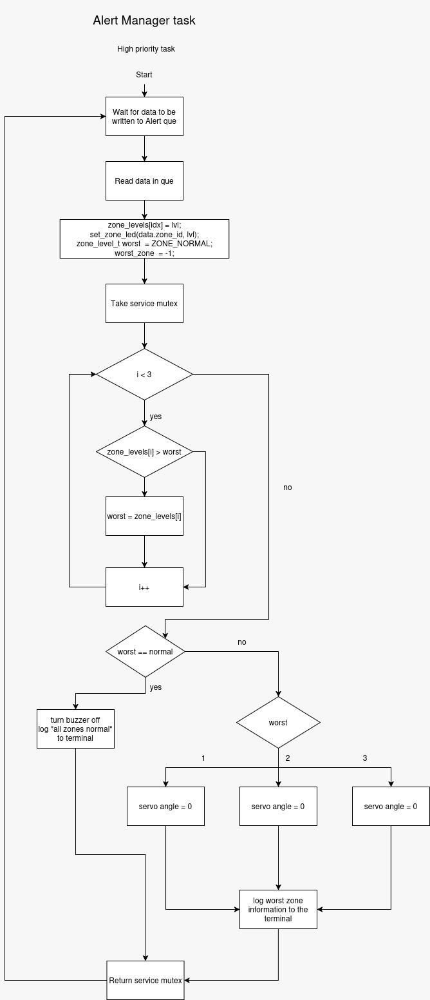
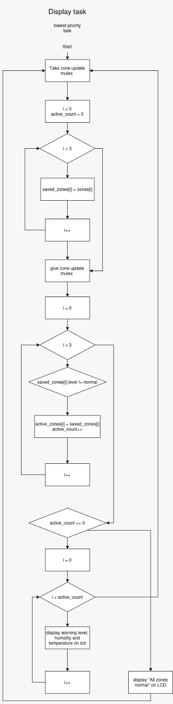
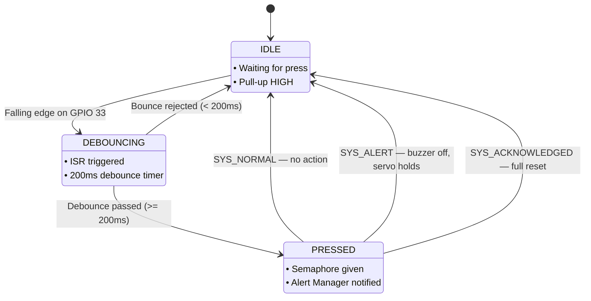
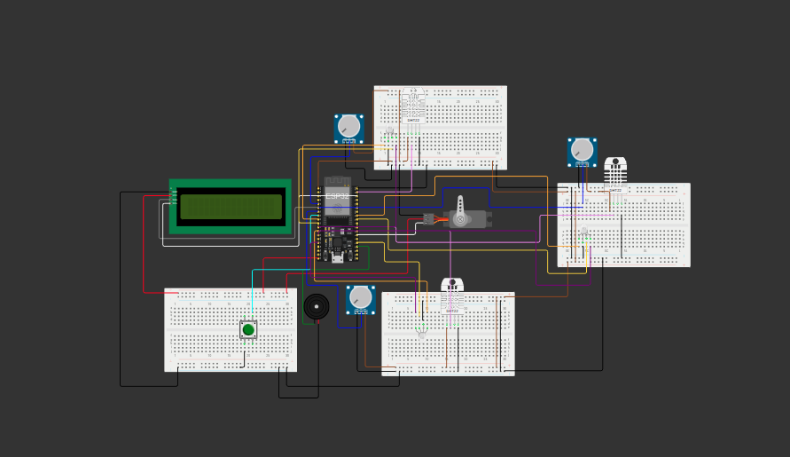
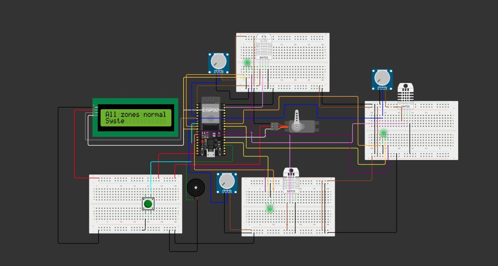
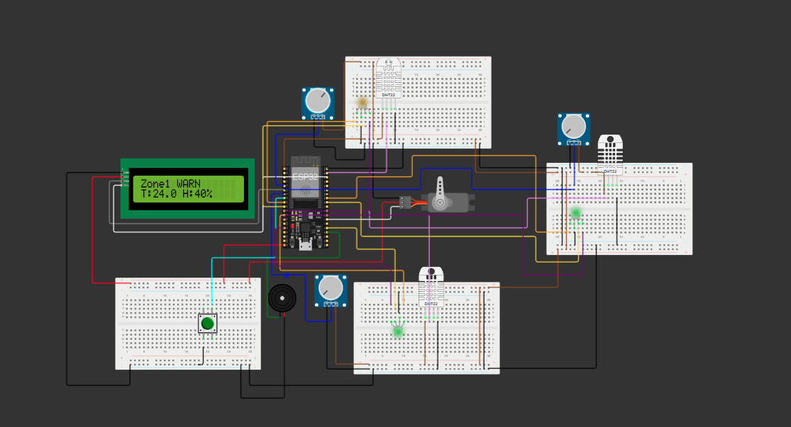
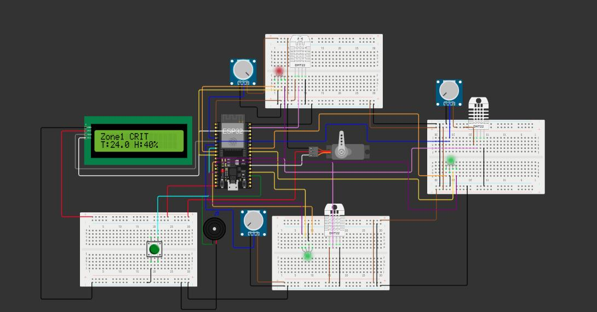
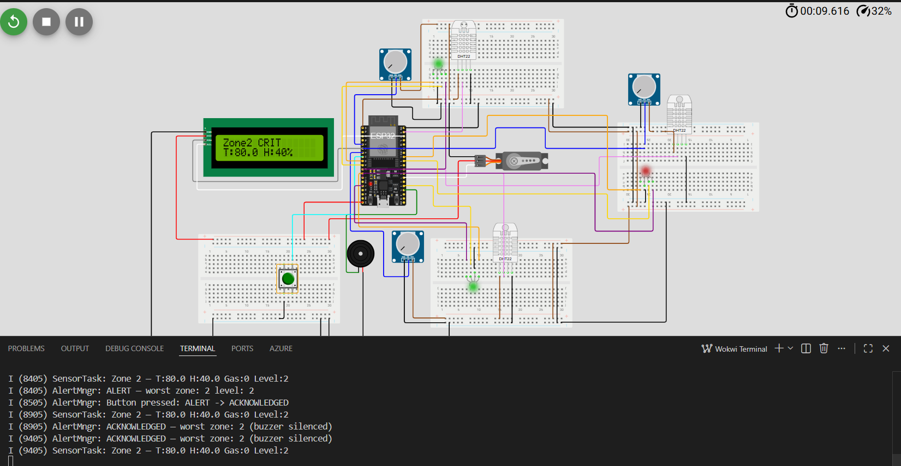

# Multi-Zone Environmental Hazard Monitoring System

## Group information

### Section number: 01

### Group number: 5

### Team members

| Name | AUS ID |
|---|---|
| Louy Yaser Abbas | b00097259 |
| Seif Al As'ad | b00101168 |
| Laith Jaradat | b00100170 |

---

## Project Description

The **Multi-Zone Environmental Hazard Monitoring System** is a real-time embedded system designed to detect environmental hazards across three different zones.

The system monitors each zone using:
- A **DHT22 sensor** to measure temperature and humidity
- A **potentiometer** to simulate gas sensor readings
- An **RGB LED** to show the condition of each zone

The project is built using an **ESP32 DevKit** and implemented with **FreeRTOS**. Each zone is monitored independently, and the system classifies the condition of each zone as:

- **Normal**
- **Warning**
- **Critical**

When a warning or critical condition is detected, the system responds immediately using visual, audio, mechanical, and display outputs.

The system:
- Changes the RGB LED color based on the zone status
- Activates a buzzer during active hazards
- Moves a servo motor to point toward the most dangerous zone
- Displays zone readings and system status on a 16x2 I2C LCD
- Uses a push button for manual override/acknowledgement behavior

This project is mainly designed for safety applications such as smart buildings, warehouses, industrial plants, and data centers where environmental hazards need to be detected early.

---

## System Diagram

The system was designed and simulated using **Wokwi**.

### Wokwi / Circuit Diagram

Add  Wokwi screenshot here:

## Main Hardware Components

| Component | Quantity | Purpose |
|---|---:|---|
| ESP32 DevKit C V4 | 1 | Main microcontroller |
| DHT22 Sensor | 3 | Measures temperature and humidity for each zone |
| Potentiometer | 3 | Simulates gas sensor readings |
| RGB LED | 3 | Shows each zone status |
| Servo Motor | 1 | Points toward the highest-risk zone |
| Passive Buzzer | 1 | Gives audio alarm during hazards |
| 16x2 I2C LCD | 1 | Displays system readings and status |
| Push Button | 1 | Manual override / acknowledgement input |

---

## Pin Configuration

| Component | ESP32 GPIO | Protocol / Interface |
|---|---|---|
| DHT22 Zone 1 | GPIO 23 | 1-Wire |
| DHT22 Zone 2 | GPIO 16 | 1-Wire |
| DHT22 Zone 3 | GPIO 17 | 1-Wire |
| Potentiometer Zone 1 | GPIO 34 | ADC1 |
| Potentiometer Zone 2 | GPIO 35 | ADC1 |
| Potentiometer Zone 3 | GPIO 32 | ADC1 |
| RGB LED Zone 1 R/G/B | GPIO 25 / 26 / 27 | PWM / GPIO |
| RGB LED Zone 2 R/G/B | GPIO 14 / 2 / 13 | PWM / GPIO |
| RGB LED Zone 3 R/G/B | GPIO 19 / 18 / 12 | PWM / GPIO |
| Servo Motor | GPIO 4 | LEDC PWM |
| Buzzer | GPIO 15 | LEDC PWM |
| LCD SDA / SCL | GPIO 21 / 22 | I2C |
| Push Button | GPIO 33 | GPIO Pull-up |

---

## How It Works

The system continuously reads environmental data from three zones.

Each zone has its own sensor task. The task reads temperature, humidity, and gas level, then classifies the zone as **Normal**, **Warning**, or **Critical**.

The updated zone status is stored in shared memory and protected using a mutex.

If a zone becomes warning or critical, the sensor task sends a message to the alert manager task through a FreeRTOS queue.

The alert manager then:

1. Receives the alert message.
2. Updates the RGB LED color for the related zone.
3. Checks all zones to find the worst active condition.
4. Turns on the buzzer if any zone is unsafe.
5. Moves the servo motor to point toward the highest-risk zone.
6. Turns off the buzzer when all zones return to normal.

The display task runs separately and updates the LCD with the latest zone readings and system status.

The button task allows manual override by moving the servo away from the current zone, simulating an emergency/manual action such as opening a door or redirecting the mechanical alert.

---

## System States

| State | Meaning | System Response |
|---|---|---|
| Normal | All readings are safe | Green LEDs, buzzer off |
| Warning | One or more readings are near unsafe levels | Warning LED color, system continues monitoring |
| Critical | Temperature, humidity, or gas exceeds critical threshold | Red LED, buzzer on, servo points to dangerous zone |

---

## Flowcharts & State Diagrams

### System Architecture

<p align="center">
  
</p>

### Sensor Task

<p align="center">
  
</p>

### Alert Manager Task

<p align="center">
  
</p>

### Display Task

<p align="center">
  
</p>

### Button Override

The button ISR fires on a falling edge (GPIO 33). A 200 ms software debounce prevents false triggers. The effect of each press depends on the current system state — it either silences the buzzer or fully resets the system.



---

## Project Impact

This project has a strong real-life safety application.

In many places such as warehouses, factories, smart buildings, and data centers, hazards like gas leaks and overheating can cause serious damage if they are not detected quickly.

The impact of this system is that it provides:

- Early detection of environmental hazards
- Multi-zone monitoring instead of only one area
- Faster response using automatic alerts
- Clear visual feedback using RGB LEDs
- Audio warning using a buzzer
- Mechanical direction indication using a servo motor
- Live status updates using an LCD
- Manual override using a push button

This makes the system useful as a low-cost prototype for automated safety monitoring.

---

## FreeRTOS Implementation

The project uses **FreeRTOS** to run multiple tasks concurrently. This allows the ESP32 to monitor sensors, update the display, handle alerts, and respond to button input at the same time.

---

### Tasks

| Task Name | Priority | Trigger / Period | What It Does | Time Constraints |
|---|---:|---|---|---|
| `vZoneSensorTask_Z1` | 2 | Periodic, every 500 ms | Reads temperature, humidity, and gas value for Zone 1. Updates shared zone data and sends alert messages when needed. | Must sample regularly so hazards are detected quickly. |
| `vZoneSensorTask_Z2` | 2 | Periodic, every 500 ms | Reads temperature, humidity, and gas value for Zone 2. Updates shared zone data and sends alert messages when needed. | Must sample regularly so hazards are detected quickly. |
| `vZoneSensorTask_Z3` | 2 | Periodic, every 500 ms | Reads temperature, humidity, and gas value for Zone 3. Updates shared zone data and sends alert messages when needed. | Must sample regularly so hazards are detected quickly. |
| `vAlertMngrTask` | 3 | Event-driven, triggered by `xAlertQueue` | Receives alert messages, updates LEDs, controls buzzer, finds the worst zone, and moves the servo toward the highest-risk zone. | Should respond quickly after sensor updates because it controls the safety outputs. |
| `vDisplayTask` | 1 | Periodic display update | Reads zone data and shows readings/status on the 16x2 I2C LCD. | Lower priority because LCD feedback is not as time-critical as alerts. |
| `vButtonTask` | 4 | Checks push button input | Handles manual override by taking the service mutex and moving the servo to a safe/override position. | Highest priority because user input should respond quickly. |

---


### Task Communication and Synchronization

The system uses FreeRTOS communication and synchronization tools to avoid race conditions and coordinate tasks safely.

| FreeRTOS Object | Type | Used By | Purpose |
|---|---|---|---|
| `xAlertQueue` | Queue | Sensor tasks → Alert Manager task | Sends alert messages containing the zone ID and alert level. |
| `xZoneMutex` | Mutex | Sensor task and Display task | Protects shared zone data stored in `zones[3]`. |
| `xServiceMutex` | Mutex | Alert Manager task and Button task | Prevents the servo/buzzer service outputs from being controlled by two tasks at the same time. |

---

### Shared Data

The system uses a global array:

```c
ZoneStatus_t zones[3];
```

This stores the latest values for each zone:

- Zone ID
- Temperature
- Humidity
- Gas level
- Zone status level

Because multiple tasks access this data, `xZoneMutex` is used to protect it.

---

### Queue Message

The alert queue sends messages using:

```c
AlertMsg_t
```

Each message contains:

- `zone_id`
- `level`

This allows the alert manager task to know which zone changed and what the new danger level is.

---

## System Photo



---

## Screenshots

Add screenshots of the Wokwi simulation in different states.

### Normal State



**Description:**  
All zones are safe. RGB LEDs show normal condition, the buzzer is off, and the LCD shows normal readings.

---

### Warning State



**Description:**  
At least one zone reaches warning level. The related RGB LED changes color, and the system continues monitoring the zone.

---

### Critical State



**Description:**  
At least one zone reaches critical level. The buzzer turns on, the RGB LED becomes red for the critical zone, and the servo motor points toward the highest-risk zone.

---

### Manual Override / Button Press



**Description:**  
When the button is pressed, the button task changes system state from ALERT to ACKNOWLEDGE. This silences the buzzor.

---

## Video

[](https://youtu.be/jbKNFUH1YdE)


---

## Tools Used

- ESP32 DevKit C V4
- FreeRTOS
- ESP-IDF
- PlatformIO
- VS Code
- Wokwi Simulator
- C programming language

---

## Summary

This project demonstrates a real-time embedded safety monitoring system using ESP32 and FreeRTOS.

It monitors three zones at the same time, detects environmental hazards, and responds using LEDs, a buzzer, a servo motor, an LCD, and button input.

The project shows important embedded system concepts, including:

- Multitasking
- Sensor monitoring
- Queue-based task communication
- Mutex-protected shared data
- PWM actuator control
- I2C LCD communication
- ADC input reading
- Real-time alert handling
